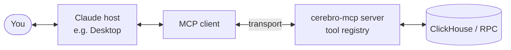
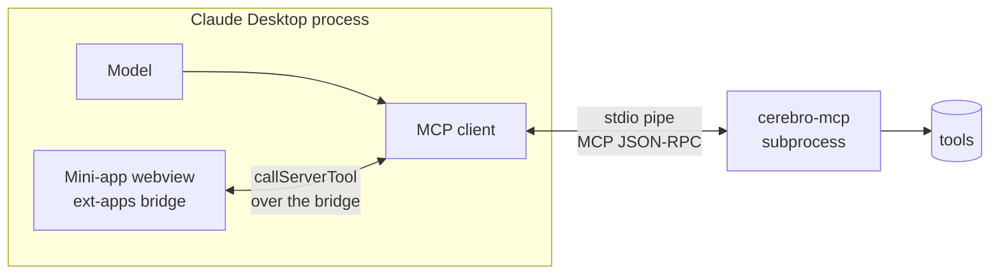
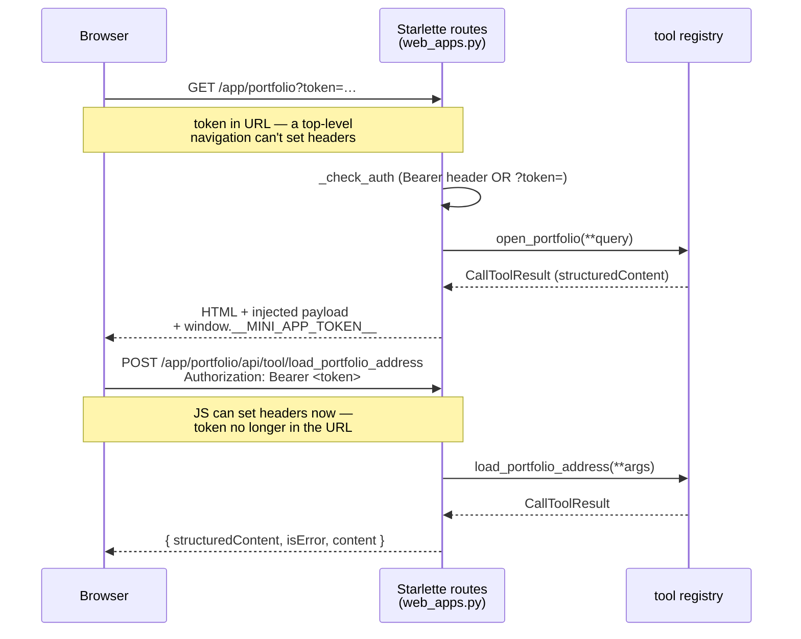

# Cerebro Mini-Apps

Cerebro ships interactive mini-apps that run inside any MCP-aware host
(Claude Desktop, Claude Code, custom hosts). Each is a React + ECharts UI
built by Vite into a single-file HTML bundle, served by the cerebro-mcp server
over an `ui://cerebro/<app>` resource URI, and driven by MCP tools.

This document is a single-page tour of every app: what it does, how to launch
it, how to develop it, and how it talks to the backend.

---

## Apps at a glance

| App                | Resource URI                       | What it shows                                                | Entry tool                    |
|--------------------|------------------------------------|--------------------------------------------------------------|-------------------------------|
| Report Renderer    | `ui://cerebro/report`              | Interactive analytics reports from `generate_report`         | `generate_report`             |
| Metric Lab         | `ui://cerebro/metric_lab`          | Build a metric from SQL or from the semantic registry        | `open_metric_lab*`            |
| Portfolio (dev-only) | `ui://cerebro/portfolio`         | Address-centric portfolio across Circles / GPay / yields. Registered only when `DEV_MINI_APPS_ENABLED=true`. | `open_portfolio`              |
| Graph Explorer     | `ui://cerebro/graph_explorer`      | Cross-sector semantic graph (Circles trust, Safe, pools, …)  | `open_graph_explorer`         |
| Contract Explorer  | `ui://cerebro/contract_explorer`   | Per-contract: ABI, callable functions, view-call, tx decode  | `open_contract_explorer`      |
| CoW Data Explorer  | `ui://cerebro/cow_explorer`        | Indexed CoW fills, markets, intents, auctions, solvers, and entity evidence | `open_cow_explorer` |
| Governance Explorer | `ui://cerebro/governance`         | GnosisDAO Snapshot signaling + forum activity: proposals, votes, voters, forum, GIP/discussion cross-links | `open_governance` |

All apps share the same plumbing:

1. The tool returns a `MiniAppPayload` with `type: "INITIAL_LOAD"` / `"PATCH_VIEW_STATE"` / `"SHOW_WARNING"`, a set of `datasets`, and app-specific `view_state`.
2. The frontend reads the payload via `useMiniApp` (see [`ui/src/mini-apps/shared/useMiniApp.ts`](../ui/src/mini-apps/shared/useMiniApp.ts)), listens for server-pushed tool results, and can call back into the MCP host with `callServerTool`.
3. Hydration tools (`get_mini_app_rows`, `get_mini_app_state`) are hidden from the model but callable by the frontend for pagination.

---

## Delivery modes & transports

The cerebro-mcp **server only exposes tools** — it never talks to a model
directly. A *host* (Claude Desktop, Claude Code, a custom app) owns an *MCP
client*, and that client speaks the MCP protocol to the server over a
**transport**. The model decides *which* tool to call; the client issues the
call. Mini-apps reach the same tool registry through one of three paths.

### The general picture



The transport is the only thing that changes between modes — the tool registry
underneath is identical.

### Mode 1 — stdio (Claude Desktop / Claude Code)

Claude Desktop launches the server as a subprocess and talks to it over
stdin/stdout pipes (no `--sse` flag). All MCP tools work, and mini-apps render
**inline inside the host** via the ext-apps bridge. There is **no HTTP
listener**, so the standalone `/app/{id}` browser URLs are *not* served here.



The mini-app's `useMiniApp.callTool` uses the **ext-apps bridge** (the host
relays the call to its client). No HTTP, no token.

### Mode 2 — standalone web app (`--sse`, plain browser)

Run the server with `--sse` and it starts a real HTTP server (uvicorn +
Starlette). Now `GET /app/{app_id}` serves the single-file bundle with the
initial payload injected, and the frontend POSTs tool calls back to
`/app/{app_id}/api/tool/{tool}`. This path **bypasses the model and the MCP
client entirely** — it's a separate HTTP door into the same tool registry.



**Why the token is in the URL on the first request:** a browser doing a
top-level navigation (address bar or `<a href>` cross-app nav) cannot attach an
`Authorization` header, so `?token=` is the only channel. The server re-injects
it as `window.__MINI_APP_TOKEN__`; every subsequent JS-initiated `POST` sends it
as a `Bearer` header instead, so the token stays out of later URLs. It's the
client echoing a credential it already had — never an escalation. (Serialization
of `structuredContent` mirrors the MCP bridge — Pydantic `mode="json"` — so
`date`/`datetime` values become ISO strings instead of crashing `json.dumps`.)

### Mode 3 — pure-UI dev (Vite, no backend)

`npm run dev` serves every entry HTML with HMR and boots each app into its
`MOCK_PAYLOAD` fixture. No client, no transport, no ClickHouse — `callServerTool`
is unavailable, so "Call"/"Expand"/"Load address" are no-ops. Use it for layout
and styling work only (see [Pure-UI dev loop](#pure-ui-dev-loop-no-mcp-host-no-clickhouse)).

| Mode | Transport | Mini-app delivery | Tool calls | Auth |
|------|-----------|-------------------|------------|------|
| Desktop / Code | stdio pipe | inline webview (ext-apps bridge) | via host's MCP client | none (local subprocess) |
| Standalone web | HTTP/SSE (`--sse`) | `GET /app/{id}` in a browser | `POST /app/{id}/api/tool/{tool}` | `?token=` then `Bearer` header |
| Pure-UI dev | none | Vite dev server | none (mock fixtures) | none |

---

## Running the apps

### Requirements
- Python ≥ 3.11 (see `pyproject.toml`)
- Node ≥ 20 (for building UI bundles)
- An MCP-aware host (Claude Desktop, Claude Code CLI, a custom client)
- `.env` with `CLICKHOUSE_*` credentials for the live backend (not required for UI-only dev)

### One-time install

```bash
# from repo root
make install        # builds ALL UI bundles then pip install -e .
```

Or step-by-step:

```bash
make build-ui       # builds all 5 bundles + copies into src/cerebro_mcp/static/
pip install -e .
```

### Launch inside Claude Desktop

1. Add the server to your Claude Desktop config (`~/Library/Application Support/Claude/claude_desktop_config.json`):

   ```json
   {
     "mcpServers": {
       "cerebro-dev": {
         "command": "/absolute/path/to/python",
         "args": ["-m", "cerebro_mcp.server"],
         "env": { "CLICKHOUSE_URL": "…", "CLICKHOUSE_USER": "…", "CLICKHOUSE_PASSWORD": "…" }
       }
     }
   }
   ```

2. Restart Claude Desktop. Type any of the app entry phrases (e.g. “open portfolio for 0x…”, “show me the graph explorer”). The model calls the corresponding `open_*` tool and the mini-app renders inline.

### Pure-UI dev loop (no MCP host, no ClickHouse)

Each mini-app can be iterated on in isolation with Vite's HMR. The dev server hosts every entry HTML simultaneously — `CEREBRO_UI_ENTRY` only matters at **build** time (it selects which single-file bundle `vite build` emits), not for `npm run dev`.

```bash
cd ui && npm install   # first time only
npm run dev            # Vite on http://localhost:5173/
```

Open any of:

- `http://localhost:5173/`                          — Report Renderer (`index.html`)
- `http://localhost:5173/metric-lab.html`           — Metric Lab
- `http://localhost:5173/portfolio.html`            — Portfolio
- `http://localhost:5173/graph-explorer.html`       — Graph Explorer
- `http://localhost:5173/contract-explorer.html`    — Contract Explorer
- `http://localhost:5173/cow-explorer.html`         — CoW Data Explorer
- `http://localhost:5173/governance.html`           — Governance Explorer

Or from the repo root: `make dev`.

**What you get:** every app boots into its `MOCK_PAYLOAD` fixture (defined at the top of each `*App.tsx` — e.g. `ContractExplorerApp.tsx` carries a hardcoded `GnosisControllerToken` view). The layout, styling, navigation, and all client-side view-state work fully.

**What you don't get:** live data. With no MCP host attached, `useMiniApp`'s `callServerTool` is unavailable, so clicking "Call" / "Expand" / "Load address" is a no-op (you'll see `[useMiniApp] callServerTool(...) unavailable (no ext-apps host)` in the browser devtools console). Use this loop for UI work; switch to the Claude Desktop flow above for end-to-end testing against real ClickHouse + RPC.

For Graph Explorer, set `sessionStorage.ge_force_empty = '1'` in the browser console to see the catalog/empty state instead of the seeded mock.

### Rebuilding a single app

```bash
make build-ui-<app>
# e.g.
make build-ui-graph-explorer
make build-ui-portfolio
```

Each per-app target is self-contained: it builds the bundle AND copies it into `src/cerebro_mcp/static/`. After the copy, restart the MCP server (`Ctrl+C` then rerun, or restart Claude Desktop) so the server re-reads the HTML from disk.

> **Gotcha** — the server caches the HTML in-memory on first read (`_BUNDLED_*_HTML`), and the MCP host may cache the resource fetch. If you still see the old UI, kill the host's mini-app tab and reopen it.

---

## Report Renderer

**Resource**: `ui://cerebro/report`  
**Source**: [`ui/src/mini-apps/report/`](../ui/src/mini-apps/report/)  
**Tool entry**: `generate_report` — produces a report doc with `{{chart:ID}}` placeholders.

The report renderer is the "heavy hitter" — it renders a full document with
chart cards, SQL-inspect drawers (`</>`), tables, and verbatim markdown prose.
Charts are rendered via ECharts from specs stored by `generate_chart` /
`generate_charts`.

Related tools: `list_reports`, `open_report`, `export_report`, `generate_chart`, `generate_charts`.

**Workflow** (see [CLAUDE.md](../CLAUDE.md)):

1. `generate_charts` (batch, minimum 3 charts, at least one dimensional breakdown, one correlation-type, one statistical query).
2. `generate_report` assembles the report with placeholders.
3. The returned `file://` URL opens the report in the mini-app.

---

## Metric Lab

**Resource**: `ui://cerebro/metric_lab`  
**Source**: [`ui/src/mini-apps/metric-lab/`](../ui/src/mini-apps/metric-lab/)  
**Tools**: `open_metric_lab`, `open_metric_lab_from_sql`, `open_metric_lab_from_metrics`, `load_metric_lab_metric`, `update_metric_lab_chart`

A two-pane workspace:
- **Left** — metric source: either a raw SQL query, a semantic-registry metric lookup, or a list of ClickHouse models.
- **Right** — live chart + table of the result, with chart spec editable inline.

Used to draft metrics that can then be saved via `save_query` or promoted into a scheduled `generate_chart`.

---

## Portfolio

> **Dev-only.** Portfolio (and Model Lineage) register only when
> `DEV_MINI_APPS_ENABLED=true` — in the default deployment their tools are
> absent, `/app/portfolio` / `/app/model_lineage` 404, and the cross-app
> tabs hide (the chrome filters on the injected `__MINI_APP_APPS__` list).

**Resource**: `ui://cerebro/portfolio`  
**Source**: [`ui/src/mini-apps/portfolio/`](../ui/src/mini-apps/portfolio/)  
**Tools**: `open_portfolio`, `load_portfolio_address`, `load_portfolio_section`, `update_portfolio_focus`, `navigate_portfolio_relation`

Address-centric view that unifies:
- **Overview** — summary card with presence across Circles, GPay, Safe, DeFi
- **Relationships** — graph-like neighborhood (Safe owners, GPay owner events)
- **Yields** — the address's active LP and lending positions
- **GPay** — GPay Safe events, modules, and spender history
- **Circles** — avatar profile, trust relations, CRC balances, wrappers

Internally uses the same address-roles resolver that Graph Explorer does (see `int_execution_address_roles_current` in dbt-cerebro). Navigation between sections is `PATCH_VIEW_STATE`-only; datasets load on demand.

---

## Contract Explorer

**Resource**: `ui://cerebro/contract_explorer`  
**Source**: [`ui/src/mini-apps/contract-explorer/`](../ui/src/mini-apps/contract-explorer/)  
**Tools**: `open_contract_explorer`, `load_contract_explorer_address`, `contract_explorer_call_function`

Per-contract inspection backed by direct JSON-RPC reads (not dbt). Workflow:

1. Resolve ABI for the address via the local catalog → Sourcify → 4byte selector fallback. Proxies (EIP-1967, transparent, minimal) are followed automatically to the implementation.
2. Render the callable function list (view/pure only — state-changing functions are rejected at the tool layer).
3. Click a function, fill its args, fire `contract_explorer_call_function`. Result is the decoded return value(s) at `block_identifier="latest"` by default.

Use this for **single-address current state**: `balanceOf`, `totalSupply`, `owner`, `paused`, `allowance`, etc. For multi-address sweeps, historical balances, USD valuation, or aggregations, use the dbt path (`execute_query` over `fct_*_balances` etc.).

Standalone (non-mini-app) RPC tools — `contract_explore`, `contract_call_function`, `contract_decode_transaction_input`, `contract_decode_receipt_logs` — live in [`tools/rpc.py`](../src/cerebro_mcp/tools/rpc.py) and use the same `call_view_function` engine. Archive reads (non-`latest` block) require `GNOSIS_ARCHIVE_RPC_URL` in `.env`.

---

## CoW Data Explorer

**Resource**: `ui://cerebro/cow_explorer`

**Standalone**: `/app/cow_explorer`

**Source**: [`ui/src/mini-apps/cow-explorer/`](../ui/src/mini-apps/cow-explorer/) · [`cow_explorer.py`](../src/cerebro_mcp/tools/visualization/cow_explorer.py)

**Agent tool**: `open_cow_explorer`
**App-only tools**: `load_cow_explorer_section`, `search_cow_explorer`, `load_cow_entity`, `load_cow_explorer_datasets`, `load_cow_icon_overlay`

The explorer reads `cow_db` through Cerebro's read-only ClickHouse client. It
provides Live, Overview, Markets, Trades, Orders, Auctions, Solvers, Traders,
and Patterns, plus chain-scoped order, transaction, address, token, auction,
and solver details. Production starts as a ten-network Overview; Sepolia is
available through the explicit testnet selector. Blockscout is the outbound
explorer on its eight verified networks, with BscScan, Avalanche Explorer, and
Plasmascan fallbacks. No explorer API is called at runtime; token/chain icons
come from cached CoinGecko lists fetched in the background (never blocking).

v2 load model — `open_cow_explorer` runs ZERO ClickHouse queries. Each
section's `core` dataset group loads on section apply; every other group
streams in through `load_cow_explorer_datasets` (additive `PATCH_VIEW_STATE`
with a stale-scope guard). Up to four sections' datasets are retained per view
(LRU), so tab returns with an unchanged scope fingerprint render instantly
with no queries. Multi-chain aggregates read the BASE `trades` table with
checkpoint bounding and dedup-invariant `uniqExact` aggregates as per-chain
UNION arms — expanding the reorg-safe `trades_canonical` view across ten
chains exceeded the ClickHouse instance's memory; the coverage mode
`checkpoint_bounded_base_dedup` discloses the marginal orphaned-row overcount.
Row-level tapes keep the canonical view (single-chain) or `LIMIT 1 BY`
version dedup (cross-chain).

Live view: per-chain indexing pulse (checkpoint lag chips), last-hour fills /
settlements feeds, open intents waiting to execute, and the order-lifecycle
stream. The frontend polls every 30 s (5 min when the chain's checkpoint lag
exceeds 10 min — a "catching up" banner replaces the live framing), pauses
while the tab is hidden, and short server TTLs (10–30 s) make concurrent
viewers share cache.

Solver dashboards: the solver entity carries "Settlement imbalance
(order-level, trade-implied, 30d)" — per-settlement/per-token net flow between
traders and the settlement contract valued at the auction's clearing prices
(`native_wei = atoms x price / 1e18`, live-verified). AMM leg amounts, plain
ERC20 transfers, and buffer balances are NOT in `cow_db`, so this is a
behavioral signal, not audited buffer books; true buffer accounting needs a
cow-indexer extension that decodes ERC20 Transfer logs for settlement
transactions. `reference_score` is always a JSON map keyed by solver address;
multi-winner combinatorial auctions make winner ranking≠1 informational, not
a violation. Solver display names come from a bundled registry generated from
the Dune spellbook (`scripts/dev/gen_cow_solver_registry.py` regenerates
`ui/src/mini-apps/cow-explorer/model/solverRegistry.ts`).

Methodology is part of the UI contract:

- “Execution prices (settled fills),” “Auction reference prices,” and
  “Native-price API observations” are separate series.
- “Known open intents (observed snapshot)” is incomplete by design and is not
  presented as a live or complete orderbook.
- Every dataset carries its requested and actual indexed window, source/fetch
  freshness, row cap, source row count, truncation state, and warnings.
- Cross-chain Overview aggregates counts only. It never combines token amounts
  or prices, and fee-policy amounts remain grouped by token and raw policy.
- Competition solvers and settlement executors remain separately labelled
  unless indexed transaction/competition evidence connects them.

The app and Data Catalog use isolated split bundles. Their public assets remain
`/app/{app_id}/assets/{file}`, while the package stores each bundle in
`static/assets/{app_id}/` so independent builds cannot erase sibling assets.

---

## Governance Explorer

**Resource**: `ui://cerebro/governance`

**Standalone**: `/app/governance`

**Source**: [`ui/src/mini-apps/governance/`](../ui/src/mini-apps/governance/) · [`governance_explorer.py`](../src/cerebro_mcp/tools/visualization/governance_explorer.py)

**Agent tool**: `open_governance`
**App-only tools**: `load_governance_section`, `load_governance_datasets`, `search_governance`, `load_governance_entity`

Read-only governance intelligence over `governance_db` (populated by the
click-runner Snapshot + Discourse ingestors, daily cadence). Four sections —
Overview, Proposals, Voters, Forum — plus proposal / voter / forum-topic /
contributor drill-downs, global typed search, CSV export (formula-injection
neutralized), and an Ask Cerebro host-chat handoff. Everything is labelled
Snapshot off-chain signaling or forum activity; the app never claims binding
execution and never derives passed/failed semantics (quorum status is
met / missed / unspecified only).

Load model mirrors CoW v2: `open_governance` runs ZERO ClickHouse queries;
each section's `core` group loads on section apply and the rest streams via
`load_governance_datasets` (stale-scope guarded, additive PATCH). Five scopes
are retained per view (four sections + one entity), so tab returns with an
unchanged scope fingerprint are query-free. All eight `governance_db` tables
are `ReplacingMergeTree(ingested_at)` re-inserted by the daily ingestors, so
every `governance_db` read carries `FINAL`. The two external planes are the
exception: `rpc_log_indexer.v_delegate_events_gnosis` (delegations) and
`rpc_state_indexer.v_treasury_balances` (treasury) resolve dedup internally
and are queried WITHOUT `FINAL`. Treasury reads additionally MUST pin
`job_name = 'daily_treasury'` — that view spans every census job. Freshness is tracked as two independent
clocks per source (ingestion vs latest activity; `source_stale` after 24h).

Cross-source linking is two-tier and never fuzzy: the author-declared
Snapshot `discussion` URL (exact forum topic id) ranks first
(`link_source='discussion'`), exact GIP-number title matches second
(`link_source='gip'`); all candidates are shown when a GIP number maps to
several proposals/topics. Untrusted content: proposal bodies and forum raw
markdown render through react-markdown (`skipHtml`, https-only links routed
through the host `openLink`); forum cooked HTML is the DOMPurify-sanitized
fallback; images are stripped to "[image] — open on forum" chips. Date ranges
use fingerprint-stable tokens (`start_at` = `""` all-history / `"90d"` /
`"1y"` / ISO pair custom); the Proposals range matches by voting-window
overlap.

Dev loop: `npm run dev` renders against `devFixture.ts` with no backend;
against the real backend run `make build-ui-governance` and restart the
server (the standalone route serves the static bundle — check
`/app/governance/health` for the live bundle's sha256/mtime). The opt-in live
smoke suite is `CEREBRO_LIVE_CH_SMOKE=1 pytest tests/test_governance_live_smoke.py`.

---

## Graph Explorer

**Resource**: `ui://cerebro/graph_explorer`  
**Source**: [`ui/src/mini-apps/graph-explorer/`](../ui/src/mini-apps/graph-explorer/) (frontend) · [`src/cerebro_mcp/tools/semantic/graph_explorer/`](../src/cerebro_mcp/tools/semantic/graph_explorer/) (backend package)  
**Agent tools**: `open_graph_explorer`, `load_graph_explorer_seed`, `expand_graph_explorer_node`, `update_graph_explorer_focus`  
**App-only tools** (hidden from the model): `load_graph_atlas_sample`, `set_graph_explorer_view`

Cross-sector graph rendered with **cosmos.gl** (WebGL, `@cosmos.gl/graph`). Every
graph-capable semantic model in `dbt-cerebro` contributes a **profile** (see
`cerebro.graph` meta). Nodes come from the semantic registry; edges are fetched
at query time.

### Two MODES, one canvas

A segmented switch in the header flips between two modes; each keeps its own
dataset pair (`nodes`/`edges` vs `atlas_nodes`/`atlas_edges`) so switching is
instant and lossless.

1. **Atlas** (default) — browse the profile catalog grouped by sector in a
   left rail. Checking profiles loads top-weight *sample* subgraphs
   (REPLACE semantics — deselecting a profile removes its edges; sample size
   is per profile). Clicking a sampled node offers **"Investigate → "** which
   promotes it into a real seed. An address input at the top seeds directly.
2. **Investigate** — seed an address/entity → bounded 1-hop subgraph with
   role auto-detection via `int_execution_address_roles_current` → expand
   hop-by-hop (explicit action only; default depth 1, stepper up to the
   session cap) → inspect role badges, edge evidence, and suggested
   cross-sector next hops in the details panel.

### view_state v2 (server is the source of truth)

```
{ mode: "atlas"|"investigate", catalog, limits: {...},
  atlas: { selected_profiles, sample_size, window_days },
  investigate: { seed, active_profiles, window_days, max_neighbors, hops_used },
  selection: { node_id, edge_id },     # cleared on mode switch
  layout, semantic_status_filter, node_roles, suggested_next_hops,
  warnings, dataset_revisions }
```

`limits` publishes the server constants (`max_hops`, `bfs_node_cap`,
`default_expand_depth`, `ui_default_window_days`, `ui_default_max_neighbors`,
`atlas_sample_size`) — the frontend derives every control from it and keeps
no compile-time mirrors.

### What the controls do

| Control                     | Effect                                                                                       |
|-----------------------------|----------------------------------------------------------------------------------------------|
| `Atlas / Investigate`       | Mode switch — swaps which dataset pair the canvas renders; clears selection; never refetches. |
| Atlas profile checkbox      | Debounced `load_graph_atlas_sample` with the full selection (REPLACE semantics).             |
| Window / max pills          | Debounced refetch of the investigate subgraph.                                               |
| `Force / Circle` segmented  | Client-side layout change. No backend call.                                                  |
| `All / ● / ●` status        | Filters profiles by quality tier.                                                            |
| Chip click (profile strip)  | **Adds**: refetch with the profile mixed in. **Removes**: client-side filter only.           |
| Depth stepper + `+ Expand`  | Expands the selected node (else the seed) by the stepped depth (default **1**).              |
| Node click                  | Selects; server refreshes role badges + evidence + suggested next hops.                      |
| Node double-click           | Expands that node by the stepped depth.                                                      |
| Play/Pause · Fit · Recenter · Focus · Labels · Legend | Canvas-local controls (ephemeral — reset on reload).               |
| Details → Expand / Recenter / Copy | Same as before (Recenter reseeds from the selected node).                             |

There is **no "Ask" button** — it was removed at user request (WS10). The app
publishes passive model context (`mode`, seed, selection, profile set, node/
edge counts, hops) via `updateModelContext` so the agent can see the view.

### Profiles (as of initial release)

| Profile                        | Model                                                      | Source → Target          | Quality   |
|--------------------------------|------------------------------------------------------------|--------------------------|-----------|
| `circles_trust`                | `api_execution_circles_v2_trust_relations_current`         | circles_avatar → circles_avatar | approved |
| `circles_trust_history`        | `api_execution_circles_v2_avatar_trust_relations`          | circles_avatar → circles_avatar | candidate |
| `circles_avatar_balances`      | `fct_execution_circles_v2_avatar_balances_latest`          | circles_avatar → token   | approved |
| `safe_ownership`               | `int_execution_safes_current_owners`                       | address → safe           | candidate |
| `gpay_ownership`               | `int_execution_gpay_wallet_owners`                         | address → gpay_wallet    | candidate |
| `token_transfers`              | `int_execution_transfers_whitelisted_daily`                | address → address        | candidate |
| `lp_in_pool`                   | `int_execution_pools_dex_liquidity_events`                 | address → pool           | approved |
| `pool_contains_token`          | `int_execution_pools_dex_liquidity_events`                 | pool → token             | approved |
| `lending_user_to_reserve`      | `fct_execution_yields_user_lending_positions_latest`       | address → token          | approved |
| `validator_controlled_by`      | `int_consensus_validators_withdrawal_addresses`            | address → validator      | approved |
| `deposit_to_validator`         | `int_GBCDeposit_deposists_daily`                           | address → validator      | approved |
| `bridge_user_flows`            | `int_execution_bridges_address_flows_daily`                | address → bridge         | candidate |
| `address_labeled_as`           | `stg_crawlers_data__dune_labels`                           | address → project_label  | approved |

### Supporting dbt models

- `int_execution_address_roles_current` — one row per address with role flags (is_safe, is_gpay_wallet, is_circles_avatar, …). Powers auto-detection on seed and the role badges in the details panel.
- `int_consensus_validators_withdrawal_addresses` — derives the controlling EVM address from `withdrawal_credentials` (trailing 20 bytes of 0x01-type credentials).
- `int_execution_bridges_address_flows_daily` — address-grain bridge flows (joins whitelisted transfers with dune bridge labels).

### Cross-sector relationships

Authored in `semantic/relationships/execution_graph.yml` (dbt-cerebro). These drive the "suggested next hops" chips in the details panel — when a node is selected, the registry's relationship graph proposes which cross-sector profile to overlay next.

Key cross-sector edges:
- `gpay_wallet_is_safe` — GPay Safes are Safes (type-tag).
- `ga_user_controls_gpay` — **Canonical** EOA → GP Safe binding via Delay Module. Do NOT use `safes_current_owners.owner` (returns sentinel `0x…0002`).
- `circles_avatar_is_address` — avatars are first-class addresses.
- `deposit_to_validator_identity` — `withdrawal_credentials` joins GBCDeposit and consensus.
- `validator_address_is_safe` — the 20-byte withdrawal address is often a Safe.
- `address_labeled_as_project` — universal enrichment via Dune labels.

### Knobs

All in [`src/cerebro_mcp/tools/semantic/graph_explorer/constants.py`](../src/cerebro_mcp/tools/semantic/graph_explorer/constants.py) and published to the UI via `view_state["limits"]`:

- `MAX_HOPS = 50` — session hop cap (deliberately raised in WS9, live-QA'd in WS10).
- `DEFAULT_EXPAND_DEPTH = 1` — UI default hops per expand action.
- `UI_DEFAULT_WINDOW_DAYS = 90` / `UI_DEFAULT_MAX_NEIGHBORS = 100` — UI load defaults.
- `DEFAULT_ATLAS_SAMPLE = 150` — Atlas sample size per profile.
- `DEFAULT_WINDOW_DAYS = 365` / `DEFAULT_MAX_NEIGHBORS = 250` — the PUBLIC
  `explore_neighborhood`/`calculate_flow_efficiency` tool defaults (a pinned
  contract; distinct from the UI defaults on purpose).
- BFS caps `GRAPH_EXPLORER_BFS_NODE_CAP` (15000) / `GRAPH_EXPLORER_BFS_PER_HOP_BUDGET` (3000) — env-tunable settings.

---

## Adding a new mini-app

A mini-app has five files on the backend and about six on the frontend. Use `cow_explorer` or `governance_explorer` (both under `tools/visualization/`) as the canonical v2 template — zero-query opener, deferred `SECTION_GROUPS`, scope fingerprints, partial-failure isolation.

### Backend

1. `src/cerebro_mcp/tools/visualization/<app>.py`
   - Define `APP_ID`, `URI`, `DEFAULT_TITLE`, and a `register_<app>_tools(mcp, ch)` function.
   - In `register_*_tools`:
     - `mini_apps.register_app(APP_ID, title=..., resource_uri=URI)`
     - `@mcp.resource(URI, mime_type="text/html;profile=mcp-app")` → return the bundled HTML via `importlib.resources`.
     - `@mcp.tool(meta={"ui": {"resourceUri": URI}})` for each interaction. `open_*` returns `INITIAL_LOAD`; `update_*_focus` returns `PATCH_VIEW_STATE`.
   - Use `mini_apps.run_structured_query` or `mini_apps.load_bounded_dataset` for ClickHouse queries — they handle caching and dataset-mode rules.
2. `src/cerebro_mcp/server.py` — call `register_<app>_tools(mcp, ch)`.
3. `src/cerebro_mcp/security.py` — classify the `open_*` tool as `_RO` and every app-only hydration tool as `_AO` in `TOOL_RISK_REGISTRY`.
4. `src/cerebro_mcp/tools/tool_meta.py` — add an `open_*` entry (`domain` / `tier` / `tags`) to `TOOL_META`.
5. `tests/test_<app>.py` (e.g. `tests/test_governance_explorer.py`) — the app's backend suite, plus `tests/test_web_apps.py` for the shared registration/visibility assertions.

### Frontend

6. `ui/<app>.html` + `ui/src/<app>-main.tsx` — Vite entry points.
7. `ui/src/mini-apps/<app>/<App>App.tsx` — root component using `useMiniApp`.
8. Support components (`FilterBar`, `DetailsPanel`, etc.) and a scoped CSS file.
9. `ui/vite.config.ts` — add to `ENTRY_MAP`.
10. `Makefile` — add `build-ui-<app>` target (build + copy, following the pattern).

### Visibility + tests

```bash
pytest tests/test_web_apps.py tests/test_<app>.py -v
```

---

## Further reading

- [`CLAUDE.md`](../CLAUDE.md) — project-level agent instructions.
- [`docs/security.md`](security.md) — tool classification rules and SQL safety.
- [`docs/observability.md`](observability.md) — metrics and logging for the MCP server.
- [`dbt-cerebro`](https://github.com/gnosis-org/dbt-cerebro) — where the semantic registry and graph metadata live.
